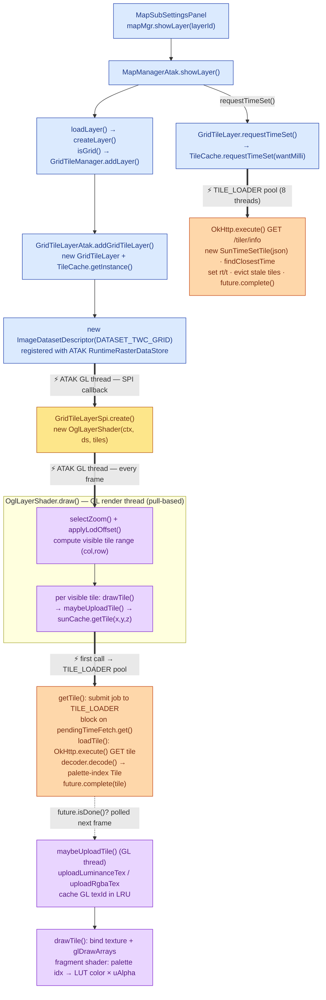

# OpenGL Grid Tile Flow

*`(2-Jul-2026)`*

Description of the code flow to add a SSDS earth grid tile to ATAK map. Key areas:

- Specific tile classes
- TimeSet
- TileCache - custom product end-points, conversion, etc.
- OpenGL Shader

Walk through of adding a SSDS Grid Tile Layer ...

## Async Flow Diagram

Unlike the vector flow (see `map-vector-layer-flow.md`), the grid flow is **pull-based**: after the layer is registered, ATAK's **GL render thread** drives everything. It calls `OglLayerShader.draw()` on every frame, which computes the visible tile range and *pulls* each tile from `TileCache.getTile()`. Tiles that aren't cached yet return immediately as an in-flight `CompletableFuture` — the tile is simply skipped that frame and picked up on a later frame once its data has arrived (`future.isDone()`).

Two async mechanisms are involved, **neither** is the vector path's `enqueue()` + `handleAsync()`:

- **`TILE_LOADER`** — a dedicated fixed pool of **8 daemon threads** (`TileCache`). Both the `/info` time-set fetch and every tile fetch run here using **blocking** OkHttp `.execute()`, so the GL thread is never blocked on the network.
- **ATAK GL render thread** — owns `draw()`, texture upload, and per-frame `future.isDone()` polling. GL texture creation/deletion must happen here.

Thick arrows (`==>`) mark a hand-off to a different thread; the dashed arrow marks the per-frame poll that makes loading asynchronous.



**Legend**

| Color     | Thread context                                              | Stage                                                                           |
| --------- | ----------------------------------------------------------- | ------------------------------------------------------------------------------- |
| 🟦 blue   | UI / main thread (synchronous)                              | selection → `showLayer` → `loadLayer` → `createLayer` → descriptor registration |
| 🟨 amber  | ATAK GL thread (SPI callback)                               | `GridTileLayerSpi.create()` → `new OglLayerShader`                              |
| 🟧 orange | `TILE_LOADER` pool — 8 threads (**async, blocking OkHttp**) | `/info` time-set fetch and per-tile fetch + decode                              |
| 🟪 purple | ATAK GL render thread (per frame)                           | tile-range selection, `future.isDone()` poll, texture upload, draw              |

> Note: the time set is requested once per (product, ~5-minute step); the OkHttp interceptor also caches the `/info` URL, so repeat calls hit memory. All tiles in a session share the same `rt`/`t` frame time so they stay temporally consistent.

## [MapManager](https://github.com/TheWeatherCompany/drop-red/blob/main/twc-civ/plugins/weather5/wxlib/src/main/java/com/twc/wxlib/map/MapManager.java)

- To add a layer to the map, call showLayer()

Example from MapSubSettingsPanel.java

```
showDataRangeDropDown()
       mapMgr.showLayer(layerId);
```

## [MapManagerAtak](https://github.com/TheWeatherCompany/drop-red/blob/main/twc-civ/plugins/weather5/app/src/main/java/com/atakmap/android/weather2/map/MapManagerAtak.java)

- Custom implementation that manages map layers for __ATAK__.

- MapManager __showLayer()__ will chain calls to __loadLayer()__ which calls GridTileManager's __addLayer()__
  
  ```
  MapManagerAtak.java
    loadLayer()
             this.frameMilli = frameMilli;   // save requested time
        ...
             mapLayer = MapManagerAtak.createLayer(this, name, elevFeet, filters);
        ...
             showLayer(futureTileSet, mapLayer, frameMilli, layerId, framePeriod, filters);
  
    createLayer()
        if (isGrid(layerId)) {
               mapLayer = GridTileManager.addLayer(mapMgr, getOkHttpClient(), toMapLayerId(layerId, ""));
  ```
  
  Note - After the layer is created, the call to showLayer() will request the time set inventory. This is discussed further down.

## [GridTileManager](https://github.com/TheWeatherCompany/drop-red/blob/main/twc-civ/plugins/weather5/app/src/main/java/com/atakmap/android/weather2/map/tiles/GridTileManager.java)

- A specific manager to handle the map tile data that is not PNG images and requires custom processing, such as converting a grid of floating point values to a color palette.

Example flow in GridTileManager

```
    static addLayer()
             return INSTANCE.addLayer(mapMgr, httpClient, mapLayerId, 256);

    addLayer()
           GridTileLayer gridLayer = addGridTileLayer(mapMgr, httpClient, mapView, mapLayerId);
```

## [GridTileLayerAtak](https://github.com/TheWeatherCompany/drop-red/blob/main/twc-civ/plugins/weather5/app/src/main/java/com/atakmap/android/weather2/map/tiles/GridTileLayerAtak.java)

- A specific version of GridTileLayer to work with __ATAK__
- Creates an ImageDatasetDescriptor which causes __registered__ ATAK listeners to get called to take turns deciding if they can handle the new image type. See below call to __registerSpi()__.

Example flow in GridTileLayerAtak:

```
    addGridTileLayer()
            GridTileLayer gridLayer = new GridTileLayer(mapMgr, httpClient, mapLayerId, null);


            ImageDatasetDescriptor desc = new ImageDatasetDescriptor(filename,                     // dataset name — must match the stub filename so
                //   getProductFor(ds.getName()) and getTileDimFor()
                //   can decode the product + tile size from it
                uri,                          // URI — real filesystem path to the stub file
                DATASET_TWC_GRID,                 // provider
                DATASET_TWC_GRID,                 // datasetType — matched by registered dataset types
                filename,                     // imageryType — mirrors what DatasetDescriptorSpi sets
                width, height, tiles.getZoomLevel().length,  // 14 zoom levels
                upperLeft, upperRight, lowerRight, lowerLeft, tiles.getSRID(),              // 3857 (Mercator)
                false,                        // isRemote=false → LOCAL
                null,                         // workingDir
                Collections.emptyMap());
```

## Registering ATAK listeners

- There are a set of ATAK register calls, here we ues the SPI call to add our handler to the map layer listeners.

Example from [GridTileLayerSpi](https://github.com/TheWeatherCompany/drop-red/blob/main/twc-civ/plugins/weather5/app/src/main/java/com/atakmap/android/weather2/map/tiles/GridTileLayerSpi.java), __DATASET_TWC_GRID__ is the token that binds to our object used above in the descriptor.

```
    GLMapLayerFactory.registerSpi(GridTileLayerSpi.INSTANCE);


    When GridTileLayerAtak creates the ImageDatasetDescriptor with datasetType DATASET_TWC_GRID
    it causes this registered class GridTileLayerSpi.create() to get called.

    public GLMapLayer3 create(Pair<MapRenderer, DatasetDescriptor> arg)

            return new OglLayerShader(ctx, dataset, tiles);
```

## OpenGL

- Class [OglLayerShader](https://github.com/TheWeatherCompany/drop-red/blob/main/twc-civ/plugins/weather5/app/src/main/java/com/atakmap/android/weather2/map/opengl/OglLayerShader.java) is one of the main OpenGL map layer shader classes that handles loading, conversion and rendering of the earth tile data.

- The raw tile management is handled by __TileCache__.

- A cache of __TileCache__ instances is saved in a Map<> and referenced by the product definition.

- Currently this cache of caches is not doing much since we only show a single layer at a time and is flushed every time a new layer is added.
  
    Example making TileCache
  
  ```
        this.sunCache = TileCache.getInstance(product, tileDim, flightLevel, true);
  ```

### The render loop — `draw()` (called every frame on the ATAK GL thread)

This is the heart of the pull-based flow. ATAK invokes `draw(GLMapView)` each frame; there is no push/callback that says "a tile arrived — redraw". Instead each frame re-derives what is visible and pulls it:

```
    draw(glView)
        if (prog < 0) initGL();                 // lazy one-time GL program + LUT upload
        // delete GL textures evicted from the LRU cache (must run on GL thread)
        ZoomLevel zl = selectZoom(resolution);  // finest level ≥ screen resolution
        zl = applyLodOffset(zl);                 // coarsen via LOD_TABLE (fewer tiles)
        // inverse-project screen corners → visible tile (col,row) range, handle
        //   full-hemisphere, tilted-limb and antimeridian (dateline) wrap cases
        for (row ...) for (col ...)
            drawTile(glView, zl, col, row);      // Pass 1: current LOD, writes stencil
        // Pass 2: fill gaps with parent-LOD tiles where stencil==0 (already-cached)
```

- __selectZoom() / applyLodOffset()__ — pick the finest tile level whose resolution is ≥ the screen resolution, then coarsen it via the static `LOD_TABLE` (trades sharpness for fewer tile fetches).
- __Two-pass stencil rendering__ — Pass 1 draws current-LOD tiles and marks the stencil buffer; Pass 2 draws the coarser parent-LOD tiles only where Pass 1 left gaps (unloaded tiles). Parent tiles are almost always already cached, so gap-filling costs no extra network fetches.

### `drawTile()` → `maybeUploadTile()` — the async pull point

```
    drawTile(glView, zl, col, row)
        Integer texId = tileTexIdCache.get(key);      // GL texture LRU
        if (texId == null)
            texId = maybeUploadTile(col, row, level);  // may return null (in flight)
        if (texId == null) return;   // not ready — skip this frame, retry next frame
        if (texId == 0)    return;   // sentinel: server has no data here, never retry
        // project tile corners (8 Mercator strips) and glDrawArrays

    maybeUploadTile(col, row, zoom)
        CompletableFuture<Tile> future = sunCache.getTile(col, row, zoom);  // non-blocking
        if (!future.isDone()) return null;         // still fetching → try again next frame
        Tile tile = future.join();
        // upload palette-index bytes (GL_LUMINANCE) or ARGB (GL_RGBA) → cache GL texId
```

The GL thread never blocks on the network: `getTile()` returns instantly, and the tile is only uploaded once a later frame observes `future.isDone()`.

## TimeSet

- TimeSet is a collection of classes to hold the inventory of available times for the data object (map layer).
- There are several TimeSet implementations:
  - [SunDataTimes](https://github.com/TheWeatherCompany/drop-red/blob/main/twc-civ/plugins/weather5/wxlib/src/main/java/com/twc/wxlib/map/mapTiles/SunDataTimes.java)
  - [SunTimeSetRaster](https://github.com/TheWeatherCompany/drop-red/blob/main/twc-civ/plugins/weather5/wxlib/src/main/java/com/twc/wxlib/map/sun/SunTimeSetRaster.java)
  - [SunTimeSetTile](https://github.com/TheWeatherCompany/drop-red/blob/main/twc-civ/plugins/weather5/wxlib/src/main/java/com/twc/wxlib/map/sun/SunTimeSetTile.java)     "https://api.weather.com/v2/tiler/info?products={code:name}&apiKey={key}&meta=False}"
  - [SunTimeSetVector](https://github.com/TheWeatherCompany/drop-red/blob/main/twc-civ/plugins/weather5/wxlib/src/main/java/com/twc/wxlib/map/sun/SunTimeSetVector.java)   "https://api.weather.com/v2/vector-api/products/{name}/info?meta=true&apiKey={key}"
  - [CustomTimeSet](https://github.com/TheWeatherCompany/drop-red/blob/main/twc-civ/plugins/weather5/wxlib/src/main/java/com/twc/wxlib/map/sun/CustomTimeSet.java)
  - [CurrentLabTimeSet](https://github.com/TheWeatherCompany/drop-red/blob/main/twc-civ/plugins/weather5/wxlib/src/main/java/com/twc/wxlib/map/sun/CurrentLabTimeSet.java)
  - [SofarTimeSet](https://github.com/TheWeatherCompany/drop-red/blob/main/twc-civ/plugins/weather5/wxlib/src/main/java/com/twc/wxlib/map/sun/SofarTimeSet.java)
  - WindBorneTimeSet
  - [TafTimeSet](https://github.com/TheWeatherCompany/drop-red/blob/main/twc-civ/plugins/weather5/wxlib/src/main/java/com/twc/wxlib/map/mapTiles/TafLayer.java) (nested class in `TafLayer`)

## [SunTimeSetTile](https://github.com/TheWeatherCompany/drop-red/blob/main/twc-civ/plugins/weather5/wxlib/src/main/java/com/twc/wxlib/map/sun/SunTimeSetTile.java)

- The Tile timeset stores inventory of various SSDS tile products.
- The time set data is loaded by a call to GridTileLayer's  __requestTimeSet()__.
- The call is made back inside MapManagerAtak's __showLayer()__.

Example of MapManagerAtak showLayer()

```
    private void showLayer(
            CompletableFuture<MapTimeSet> futureTileSet,
            MapLayer mapLayer,
            long frameMilli,
            @NonNull String layerId,
            @NonNull DataPeriod framePeriod,
            @NonNull MapFilters filters) {
        long epochSec = TimeUnit.MILLISECONDS.toSeconds(frameMilli);

        mapLayer.requestTimeSet( ).handleAsync( (tileSet, exception1) -> { ... } );
     }
```

- When the mapLayer is an instance of GridTileLayer, it calls its __requestTimeSet()__, which in turn calls the TileCache's __requestTimeSet()__,.

```
    @Override
    public CompletableFuture<? extends MapTimeSet> requestTimeSet() {
        assert(this.tileCache != null);
        return this.tileCache.requestTimeSet(mapMgr.getFrameMilli());
    }
```

## [TileCache](https://github.com/TheWeatherCompany/drop-red/blob/main/twc-civ/plugins/weather5/app/src/main/java/com/atakmap/android/weather2/map/tiles/TileCache.java)

- TileCache loads, converts and stores the tiles used by the OpenGL shader.
- RequestTimeSet should be called once per product to get its inventory of available times.
- Implements specific URL end-points based on product type.
- Implements specific tile decoders based on product type

### Main methods

- getInstance(TileProducts.TileProduct product, int tileDim, int flightLevel, boolean gridToPalIndex)
  
  - Public access to get and/or create a TileCache instance (keyed by `product + level`).
  
  - Constructor will interrogate the TileProduct and wire up lambda methods (`decoder`, `urlBuilder`) to build the required
    URLs and decode the response data, storing the final tile in a cache.
    
    TileType (enum)
    
    - FLOAT4:  256x256x4 float grid in Big Endian byte order
    - BYTE_FL50: (packed) 50 vertical levels of 512x512x1 byte data
    - PNG:  Palette (png) image tiles,  not currently used

- getTile(int x, int y, int z)
  
  - __Non-blocking.__ The first call for an (x,y,z) key submits a job to the `TILE_LOADER` pool and returns an incomplete `CompletableFuture<Tile>`; subsequent calls return the same cached future (per-key dedup via the `memCache` LruCache).
  - The pool job blocks on `pendingTimeFetch.get()` (so it never fetches a tile before the time set is known), then calls `loadTile()` → blocking OkHttp `.execute()` → `decoder.decode()` (grid-bytes → palette-index `Tile`).
  - HTTP 400 / 204 return a shared read-only `EMPTY_*_TILE`; a load failure removes the key from the cache so it can be retried on a later frame.

- requestTimeSet(long wantMilli)
  
  - Fetches time set inventory, parses the json response, saves the array of times. Populates `timeParamsStr` with the model (`rt`) and data (`t`) time strings.
  - Runs on the `TILE_LOADER` pool. Returns a completed future immediately if the (product, ~5-min step) is already loaded; returns the in-flight future if a fetch is already running (no double fetch); always completes even on failure (tiles fall back to legacy rt/t).
  - When the frame time changes it calls `memCache.evictAll()` so no tiles built with a stale `rt`/`t` survive.

### Threading — `TILE_LOADER`

`TileCache` owns a single static `ExecutorService` of __8 daemon threads__ named `sun-tile-loader`. Both the `/info` time-set fetch and every tile fetch run here with **blocking** OkHttp `.execute()` — this keeps the network entirely off the GL render thread. Note this differs from the vector flow, which uses OkHttp's async `.enqueue()` + `CompletableFuture.handleAsync()`.

Because that pool is **shared across every product/level**, a product whose tile responses are unusually large can spike memory even though the pool is only 8 threads deep — see the Range-fetch note below, which is how one such case (`packed_FLWind`) was fixed.

### HTTP Range fetch for multi-level packed tiles (`BITS8_UV`)

`packed_FLWind` (`PACKED_WIND_UV_FL_FCST`) packs **all 50 flight levels** of U/V wind components into a single tile response — `50 × 512×512 × 2 bytes ≈ 26 MB` per tile — even though a given `OglLayerShader`/`TileCache` instance only ever needs one flight level's ~512 KB slice. The original decoder called `body.bytes()`, materializing the full 26 MB per fetch just to throw away 49/50 of it; with several fetches in flight at once on the shared 8-thread `TILE_LOADER` pool (up to `8 × 26 MB ≈ 208 MB`), this was the root cause of a production `OutOfMemoryError` (heap growth limit ~256 MB).

**Fix** — `TileCache` computes an HTTP `Range` header (`bytes=<start>-<end>`) from the requested flight level before calling `loadTile()`, since each level is stored as a contiguous (U-then-V) block within the response:

```
rangeStart = level * elementsPerLevel * 2      // elementsPerLevel = tileDim*tileDim = 512*512
rangeEnd   = rangeStart + elementsPerLevel*2 - 1
```

The `/tiler/packed/data` endpoint was verified live (via `curl -H "Range: bytes=..."`) to honor this correctly — it returns `206 Partial Content` with a byte-exact `Content-Range` slice matching the full-file bytes at that offset. Only the requested level's ~512 KB is transferred and held in memory, not the full 26 MB — roughly a **50x reduction in both network transfer and peak transient heap allocation** for this product.

**Safety fallback** — if the server ever ignores the `Range` header and returns `200` with the full body instead of `206`, `loadTile()` treats that as a load failure (same retry/cooldown path as a network error) rather than decoding the wrong flight level out of an unsliced buffer.

**Scope** — currently implemented for `BITS8_UV` only. `BYTE_FL50`, `BYTES`, `BITS10`, and `BITS4` also pack each level as one contiguous block and could use the same technique. `BITS8_UVW` cannot use a single Range request as-is — its U/V/W components are stored as three separate 13-level groups, so one flight level's U and V bytes are far apart in the response (would need multiple Range requests per tile, or a multipart `Range` header, to get the same win).

## [TilePalette](https://github.com/TheWeatherCompany/drop-red/blob/main/twc-civ/plugins/weather5/app/src/main/java/com/atakmap/android/weather2/map/tiles/TilePalette.java)

  A custom version of ColorPalette which includes data converts required by the OpenGL shader.

- decodeARGB(@NonNull byte[] floatBytes, @NonNull int[] argbOut, int tileDim)
- decodeFloat4PalIdx(@NonNull byte[] floatBytes, @NonNull byte[] palIdxOut, int tileDim)
- decodeByteFlPalIdx(@NonNull byte[] inbytes, @NonNull byte[] palIdxOut, int tileDim, int flightLevel)

## Call chain summary

```
MapSubSettingsPanel → mapMgr.showLayer(layerId)
  → MapManagerAtak.showLayer()
      → loadLayer() → createLayer()          // isGrid() branch
          → GridTileManager.addLayer()
              → GridTileLayerAtak.addGridTileLayer()
                  → new GridTileLayer + TileCache.getInstance()
                  → new ImageDatasetDescriptor(DATASET_TWC_GRID)   // registered with ATAK
      → showLayer(private overload)
          → mapLayer.requestTimeSet()          // GridTileLayer → TileCache.requestTimeSet()
              → [TILE_LOADER] OkHttp.execute /tiler/info → SunTimeSetTile (set rt/t)   ⚡async

  --- ATAK GL render thread (independent, per frame) ---
  GridTileLayerSpi.create() → new OglLayerShader          // via registered descriptor   ⚡async
  OglLayerShader.draw()
      → selectZoom() + applyLodOffset()        // visible tile range
      → drawTile() → maybeUploadTile()
          → TileCache.getTile(x,y,z)           // non-blocking
              → [TILE_LOADER] block on time set → OkHttp.execute tile → decode → Tile   ⚡async
          → (later frame) future.isDone() → uploadLuminanceTex/uploadRgbaTex → GL texId
      → glDrawArrays()                         // palette idx → LUT color × uAlpha
```

## Source Files

Direct links to the classes referenced above (GitHub `main` branch):

| Class                    | Source                                                                                                                                                                                                      |
| ------------------------ | ----------------------------------------------------------------------------------------------------------------------------------------------------------------------------------------------------------- |
| MapSubSettingsPanel      | [MapSubSettingsPanel.java](https://github.com/TheWeatherCompany/drop-red/blob/main/twc-civ/plugins/weather5/app/src/main/java/com/atakmap/android/weather2/uipanel/mapsubsettings/MapSubSettingsPanel.java) |
| MapManager               | [MapManager.java](https://github.com/TheWeatherCompany/drop-red/blob/main/twc-civ/plugins/weather5/wxlib/src/main/java/com/twc/wxlib/map/MapManager.java)                                                   |
| MapManagerAtak           | [MapManagerAtak.java](https://github.com/TheWeatherCompany/drop-red/blob/main/twc-civ/plugins/weather5/app/src/main/java/com/atakmap/android/weather2/map/MapManagerAtak.java)                              |
| GridTileManager          | [GridTileManager.java](https://github.com/TheWeatherCompany/drop-red/blob/main/twc-civ/plugins/weather5/app/src/main/java/com/atakmap/android/weather2/map/tiles/GridTileManager.java)                      |
| GridTileLayer            | [GridTileLayer.java](https://github.com/TheWeatherCompany/drop-red/blob/main/twc-civ/plugins/weather5/app/src/main/java/com/atakmap/android/weather2/map/tiles/GridTileLayer.java)                          |
| GridTileLayerAtak        | [GridTileLayerAtak.java](https://github.com/TheWeatherCompany/drop-red/blob/main/twc-civ/plugins/weather5/app/src/main/java/com/atakmap/android/weather2/map/tiles/GridTileLayerAtak.java)                  |
| GridTileLayerSpi         | [GridTileLayerSpi.java](https://github.com/TheWeatherCompany/drop-red/blob/main/twc-civ/plugins/weather5/app/src/main/java/com/atakmap/android/weather2/map/tiles/GridTileLayerSpi.java)                    |
| OglLayerShader           | [OglLayerShader.java](https://github.com/TheWeatherCompany/drop-red/blob/main/twc-civ/plugins/weather5/app/src/main/java/com/atakmap/android/weather2/map/opengl/OglLayerShader.java)                       |
| TileCache                | [TileCache.java](https://github.com/TheWeatherCompany/drop-red/blob/main/twc-civ/plugins/weather5/app/src/main/java/com/atakmap/android/weather2/map/tiles/TileCache.java)                                  |
| TilePalette              | [TilePalette.java](https://github.com/TheWeatherCompany/drop-red/blob/main/twc-civ/plugins/weather5/app/src/main/java/com/atakmap/android/weather2/map/tiles/TilePalette.java)                              |
| TileProducts             | [TileProducts.java](https://github.com/TheWeatherCompany/drop-red/blob/main/twc-civ/plugins/weather5/wxlib/src/main/java/com/twc/wxlib/map/mapTiles/TileProducts.java)                                      |
| SunDataTimes             | [SunDataTimes.java](https://github.com/TheWeatherCompany/drop-red/blob/main/twc-civ/plugins/weather5/wxlib/src/main/java/com/twc/wxlib/map/mapTiles/SunDataTimes.java)                                      |
| SunTimeSetRaster         | [SunTimeSetRaster.java](https://github.com/TheWeatherCompany/drop-red/blob/main/twc-civ/plugins/weather5/wxlib/src/main/java/com/twc/wxlib/map/sun/SunTimeSetRaster.java)                                   |
| SunTimeSetTile           | [SunTimeSetTile.java](https://github.com/TheWeatherCompany/drop-red/blob/main/twc-civ/plugins/weather5/wxlib/src/main/java/com/twc/wxlib/map/sun/SunTimeSetTile.java)                                       |
| SunTimeSetVector         | [SunTimeSetVector.java](https://github.com/TheWeatherCompany/drop-red/blob/main/twc-civ/plugins/weather5/wxlib/src/main/java/com/twc/wxlib/map/sun/SunTimeSetVector.java)                                   |
| CustomTimeSet            | [CustomTimeSet.java](https://github.com/TheWeatherCompany/drop-red/blob/main/twc-civ/plugins/weather5/wxlib/src/main/java/com/twc/wxlib/map/sun/CustomTimeSet.java)                                         |
| CurrentLabTimeSet        | [CurrentLabTimeSet.java](https://github.com/TheWeatherCompany/drop-red/blob/main/twc-civ/plugins/weather5/wxlib/src/main/java/com/twc/wxlib/map/sun/CurrentLabTimeSet.java)                                 |
| SofarTimeSet             | [SofarTimeSet.java](https://github.com/TheWeatherCompany/drop-red/blob/main/twc-civ/plugins/weather5/wxlib/src/main/java/com/twc/wxlib/map/sun/SofarTimeSet.java)                                           |
| TafTimeSet (in TafLayer) | [TafLayer.java](https://github.com/TheWeatherCompany/drop-red/blob/main/twc-civ/plugins/weather5/wxlib/src/main/java/com/twc/wxlib/map/mapTiles/TafLayer.java)                                              |
